<p align="center">
  
</p>

<div align="center">

# ⚡ EdgeForge

### An AI development sandbox that runs entirely on Cloudflare's free tier — a natural-language prompt, and a live Worker on your account.

**No paid plan · No credit card · No virtual machines · 100% real deploys**

**[Try it live →](https://edgeforge.creatorplntu.workers.dev)**
**· [The pipeline animation →](docs/edgeforge-demo.svg)**

</div>

---

## Video walkthrough

Recorded against the **live** instance — a fresh browser session, real agent runs on
Workers AI, the approval queue, a real Gatekeeper upload, and the resulting live URL.
Both takes use the **same prompt**; only the model differs.

<p align="center">
  <video src="https://github.com/user-attachments/assets/4ef684c3-f014-4135-a0c3-758f640fb051" controls width="90%"></video>
  <br/>
  <em>Granite 4.0 Micro — deploys <code>videodemo.creatorplntu.workers.dev</code></em>
</p>

<p align="center">
  <video src="https://github.com/user-attachments/assets/4da63f2a-0156-4b20-bdcc-6682ea3e1981" controls width="90%"></video>
  <br/>
  <em>Qwen3 30B (A3B, FP8) — deploys <code>qwen-demo.creatorplntu.workers.dev</code></em>
</p>

Each clip: boot the UI → type the prompt → watch the agent work (`wrangler tail` in a side
panel) → review the file tree → review the approval queue → click **Approve** → the new
Worker is reachable at its `workers.dev` URL.

*The model is configurable via the `MODEL` variable on the Worker
(`@cf/ibm-granite/granite-4.0-h-micro` default, `@cf/qwen/qwen3-30b-a3b-fp8` verified).*

---

## Trademark & attribution

**Cloudflare** and the **Cloudflare logo** are trademarks or registered trademarks of
Cloudflare, Inc. in the United States and other jurisdictions, and this project is an
independent, non-commercial demonstration built **with**, and intended to run **on**, the
Cloudflare platform.

This project is **not** an official Cloudflare product. It is **not** affiliated with,
endorsed by, sponsored by, or otherwise associated with Cloudflare, Inc. The Cloudflare
logo is reproduced at the top of this document under Cloudflare's published brand
guidelines solely to identify the platform on which this project runs, and all rights,
title, and interest in and to the logo (including its copyright) remain the exclusive
property of Cloudflare, Inc. and its licensors. Please see
[Cloudflare's brand guidelines](https://www.cloudflare.com/brand/) before using their
marks, and contact [Cloudflare](https://www.cloudflare.com/) with any questions about
their trademark usage policy.

---

## The whole loop, animated

The animation below is the **entire** pipeline this project demonstrates — from
`wrangler login` on a brand-new free account to a **live** `workers.dev` URL with a human
approval in the middle:

<p align="center">
  
</p>

*If your viewer doesn't animate SVG, open [`docs/edgeforge-demo.svg`](docs/edgeforge-demo.svg)
directly — or scroll up and press play on the recorded walkthroughs.*

---

## What this is, and why it matters

EdgeForge is a working proof-of-concept: an **AI development agent that lives on the
edge**, where a natural-language prompt produces a **live Cloudflare Worker** on a real
account — with a human approving every deploy.

You describe an app in plain English. An agent running on [Workers AI] plans it, writes
real files to a durable filesystem, verifies them, and requests a deployment. A human
reviews the diff and clicks **Approve** — and a brand-new Worker goes live on the
account's `workers.dev` subdomain, pushed by the Gatekeeper through the real Cloudflare
Workers Upload API.

Everything — the agent, the filesystem, the approval queue, the budget ledger, the audit
log, and the approve-button — is a Cloudflare Worker you can run on a **free** account.

> **Why it matters:** this is a portrait of the platform in miniature. In a single demo we
> put durable state (Durable Objects + SQLite), high-volume key/value storage (KV),
> inference (Workers AI), static hosting (Workers Static Assets), and a real,
> permissioned deploy path (Workers Upload API) behind one workflow that any customer can
> reproduce for $0. It demonstrates that EdgeForge-style "AI writes code, humans ship it"
> flows are not a distant concept — they run today, on the free tier, with auditability and
> human oversight built in by construction.

---

## Live proof (real account, real deploys)

The instance at **[edgeforge.creatorplntu.workers.dev](https://edgeforge.creatorplntu.workers.dev)**
is running right now on a free account. End-to-end runs were verified live:

| Artifact | URL | Status |
|---|---|---|
| **EdgeForge platform** (this repo, live) | https://edgeforge.creatorplntu.workers.dev | ✅ serving API + UI |
| **Agent-built worker, Gatekeeper-deployed** | https://zerohour.creatorplntu.workers.dev | ✅ live, returns `{"app":"zero"}` |
| **Built by the Granite agent** (video take) | https://videodemo.creatorplntu.workers.dev | ✅ live, returns `{"message":"Hello from EdgeForge!"}` |
| **Built by the Qwen3-30B agent** (video take) | https://qwen-demo.creatorplntu.workers.dev | ✅ live, returns `{"message":"Hello from EdgeForge!"}` |

The `zerohour`, `videodemo`, and `qwen-demo` workers were **not** written by hand. A prompt
asked the agent to build each; the agent wrote `/src/index.js` into the durable filesystem;
the Gatekeeper queued it; a human approved it; and the Worker went live. The audit trail for
`deploy.request → deploy.approved` is inspectable through the API — and the walkthrough
videos below show it happen end to end.

---

## How it works

```
   You                          Cloudflare (free tier)
┌─────────┐    prompt     ┌──────────────────────────────────────────────────────┐
│  Chat   │ ──────────────▶ │  Worker (Hono)                                       │
│  UI     │                 │   ├─ /api/chat        agent loop ─┐                  │
└─────────┘                 │   │      │                         │  Workers AI     │
                           │   │      ▼                         │  (Granite)      │
                           │   │  WorkspaceDO  ◀── writes ────  │  tool calls      │
                           │   │  (Durable Object, SQLite)      │                  │
                           │   │      │  getFileTree()/readFile()                 │
                           │   │      ▼                                          │
                           │   │  Gatekeeper  ◀── deploy request ──            │
                           │   │  (KV queue + audit log)          │              │
                           │   └──────────┬───────────────────────────┘            │
                           └──────────────┼────────────────────────────────────────┘
                                          │ Approve
                                          ▼
                             Workers Upload API  →  NEW live Worker
                             (https://<name>.<subdomain>.workers.dev)
```

### The moving parts

| Layer | What it is | Cloudflare primitive |
|---|---|---|
| **Agent** | A tool-calling loop: plan → write → verify → fix → request deploy | `Workers AI · @cf/ibm-granite/granite-4.0-h-micro` |
| **Workspace** | A durable, per-user virtual filesystem the agent writes to | `@cloudflare/computer` over a **Durable Object** backed by **SQLite** |
| **Gatekeeper** | The only path from the sandbox to your account. Agent can *request*; a human must *approve* | **KV** (queue + immutable audit log) + **Workers Upload API** |
| **Budget** | A daily neuron ledger so the agent self-limits | **KV** (10,000 neurons/day free allowance, 500 reserve) |
| **Verify step** | Static-analysis checks (`exec`) instead of a shell | no containers on free tier — transparent trade-off |
| **UI** | Chat, file tree, live code-review panel, approval queue, budget meter, analytics tab | **Workers Static Assets** (built `frontend/dist`) |

### The deploy path is real

When you approve, the Gatekeeper calls the exact endpoint `wrangler deploy` uses:
`PUT /accounts/{account}/workers/scripts/{name}`, then enables the `workers.dev` route. The
deployed artifact is the module the agent wrote — no build step. Credentials (`account id`,
an API token scoped to *Workers Scripts: Edit*) are **cloudflare secrets on the Worker**,
never in the repo.

```
agent code  ──►  Gatekeeper queued  ──►  you click Approve  ──►  live on workers.dev
                 (KV deploy:<id>,        (audit log,           (real API upload +
                  audit log)              budget untouched)      subdomain enabled)
```

### Human-in-the-loop, by construction

- The agent has **no path to your account** — the only way code leaves the sandbox is the
  `deploy()` tool, and that only *queues*.
- Every action is appended to an audit log (`deploy.request`, `deploy.approved`,
  `deploy.rejected`).
- The daily neuron budget keeps an unruly agent from burning quota; the reserve
  (500 neurons) guarantees the flow itself always answers.

### Why this matters to a platform team (the enterprise read)

- **A safe way to let AI write code near production**: humans gate deploys, the AI never
  touches credentials, and every deploy has an audit trail.
- **A zero-friction onboarding wedge**: free account, no bill, no infra to stand up — a
  customer can run a full pilot the same day.
- **The platform as the product demo**: one repo showcases Durable Objects + SQLite, KV,
  Workers AI, Static Assets, the Upload API, and `wrangler` — the whole developer story on
  one screen.

---

## The `wrangler` CLI did the heavy lifting

The **Cloudflare CLI** is the backbone of all of this — the README's favorite tool because
it collapses an entire platform into commands:

```bash
# 1. Real auth against your account (OAuth in the browser)
npx wrangler login

# 2. Provision the approval/budget stores and drop ids into wrangler.toml
npx wrangler kv namespace create APPROVALS
npx wrangler kv namespace create BUDGET

# 3. Push credentials as secrets (kept out of the repo by wrangler)
printf '<ACCOUNT_ID>'                               | npx wrangler secret put CF_ACCOUNT_ID
printf '<API_TOKEN scoped to Workers Scripts: Edit>' | npx wrangler secret put CLOUDFLARE_API_TOKEN

# 4. Ship the platform worker (code + Durable Object + AI binding + KV + assets)
npm --prefix frontend run build
npx wrangler deploy

# 5. Watch the agent work in real time
npx wrangler tail edgeforge
```

Everything this project automates with one "approve" is what `wrangler deploy` does —
the Gatekeeper just does it for an artifact your agent produced, after a human says go.

> A full **standalone deploys-as-a-service** variant ships in
> [`packages/gatekeeper-deploy/`](packages/gatekeeper-deploy/) — a self-contained Worker
> exposing `/rpc/request-deploy`, `/rpc/approve-deploy`, etc., so the credential-holding
> Gatekeeper can live as its own service behind a service binding (the Cloudflare OS
> pattern).

---

## Run it yourself (free account, ~10 minutes)

**Prerequisites:** Node.js 20+, npm, a Cloudflare account (free — no card), and Workers AI
enabled on that account. Then, entirely through `wrangler`:

```bash
git clone git@github.com:NullLabTests/edgeforge.git && cd edgeforge
npm install --legacy-peer-deps
(cd frontend && npm install --legacy-peer-deps)

npx wrangler login                            # authorize in the browser

# two KV namespaces → paste the printed ids into wrangler.toml (APPROVALS, BUDGET)
npx wrangler kv namespace create APPROVALS
npx wrangler kv namespace create BUDGET

# optional but recommended: live deploys from approvals
printf '<ACCOUNT_ID>'                               | npx wrangler secret put CF_ACCOUNT_ID
printf '<API_TOKEN scoped to Workers Scripts: Edit>' | npx wrangler secret put CLOUDFLARE_API_TOKEN
# optional var (shown in wrangler.toml): CF_ACCOUNT_SUBDOMAIN = "<your-subdomain>"

npm --prefix frontend run build
npx wrangler deploy                                # live at https://edgeforge.<sub>.workers.dev
```

Then open the UI and type:

> **"Build me a hello-world API."**

Watch the file tree fill in, review the queue, and hit **Approve**. A live worker lands on
your account's `workers.dev`. To see it happen against a real agent across turns:

```bash
curl -X POST https://<your>.workers.dev/api/chat \
  -H 'content-type: application/json' \
  -d '{"prompt":"build a worker that echoes JSON","userId":"me"}'
```

---

## Repo layout

```
edgeforge/
├── src/
│   ├── index.ts          # Hono Worker: chat / file / deploy / approval API + assets
│   ├── workspace.ts      # WorkspaceDO: @cloudflare/computer FS + agent entry (SQLite)
│   ├── agent.ts          # tool-calling loop over Workers AI + offline fallback
│   ├── tools.ts          # tool defs + execution (write/read/edit/ls/find/grep/delete/exec/deploy)
│   ├── gatekeeper.ts     # Deploy Gatekeeper: queue, real upload, audit log, code review
│   ├── analytics.ts      # per-run spend/effort ledger + daily/model rollups (KV)
│   ├── budget.ts         # daily neuron ledger (KV)
│   ├── exec-sim.ts       # static-analysis verify pass (no shell, no containers)
│   ├── fs-helpers.ts / logger.ts / types.ts
├── frontend/             # React + Vite UI (chat, file tree, approval queue, analytics)
├── blueprints/ai-dev-sandbox/   # reusable Cloudflare blueprint (gadget template)
├── packages/gatekeeper-deploy/  # standalone Deploy Gatekeeper Worker (/rpc/*)
├── docs/
│   ├── edgeforge-demo.svg      # animated pipeline diagram
│   ├── cloudflare-logo.svg     # official logo (see Trademark & attribution)
│   └── video/                  # walkthrough MP4s (Granite + Qwen3-30B takes)
├── test/                 # Vitest (30 tests)
└── wrangler.toml         # worker config: DO, AI, KV, assets, subdomain
```

---

## The free-tier reality (honest)

| Layer | Approach | Free tier? |
|---|---|---|
| Agent model | Granite 4.0 Micro (~1.5 / ~10 neurons per M tokens, in/out) | ✅ 10,000 neurons/day |
| Durable filesystem | `@cloudflare/computer` over DO SQLite | ✅ |
| Approval queue + audit log + budget | KV | ✅ |
| AI-built deploys | Workers Upload API (no build step required) | ✅ |
| Verify step | static-analysis checks instead of a shell | ✅ (trade-off, below) |
| UI hosting | Workers Static Assets | ✅ |

**The one honest trade-off:** there's no real Linux shell on the free tier, so `exec`
performs syntax/structural verification rather than running `npm install` in a container.
Real containers are a Cloudflare **Workers Paid** feature — a clean, up-sell-ready boundary
for enterprise conversations. Everything else runs unmodified on a free account today.

---

## Tests

```bash
npx vitest run        # 30 passing: agent, budget, gatekeeper (incl. code review), analytics, exec engine, blueprint
npx tsc --noEmit      # type-clean
npx wrangler deploy --dry-run   # bundle check for the platform worker
```

---

## Roadmap / where it can go

- **R2-backed artifacts** on accounts where R2 is enabled (uploads today use KV fallback).
- **Zone-custom-domain deploys** for accounts with a domain attached.
- **Swappable agent models** — set `MODEL` (`granite-4.0-h-micro` default; see the two
  walkthrough videos). Larger models cost more against the free 10K neurons/day budget.
- **Real containers behind the paywall boundary** — the natural enterprise add-on.
- **Persistence of approved deploys** into Git for a single source of truth.

---

## Security notes

- Credentials are `wrangler secret` values on the Worker — never in the repo.
- The Gatekeeper's token is scoped to *Workers Scripts: Edit* (least privilege for deploys).
- The agent can never read or emit secrets; it only produces files in its sandbox.
- Approvals expire after 7 days by design; rejected deploys expire after 1.

---

<div align="center">

Built with **[Cloudflare Workers](https://developers.cloudflare.com/workers/) · Durable
Objects · KV · [Workers AI](https://developers.cloudflare.com/ai/) · Static Assets ·
[`wrangler`](https://developers.cloudflare.com/workers/wrangler/)** — on the **free tier**.

</div>

[Workers AI]: https://developers.cloudflare.com/ai/
